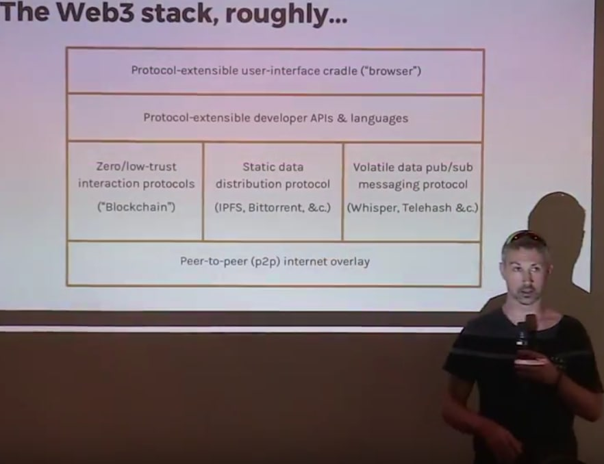
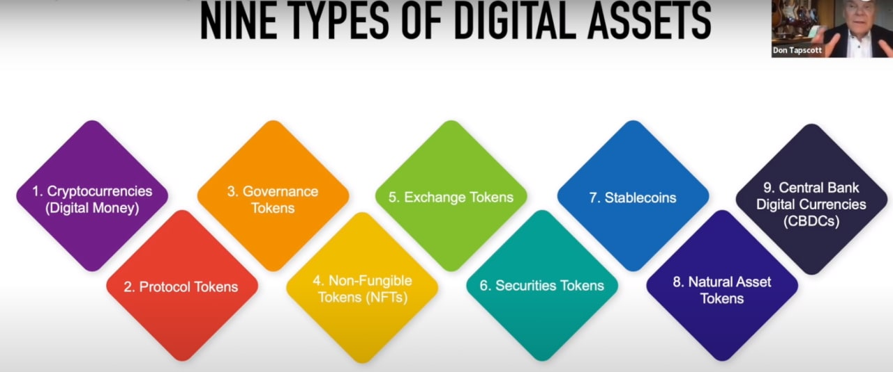
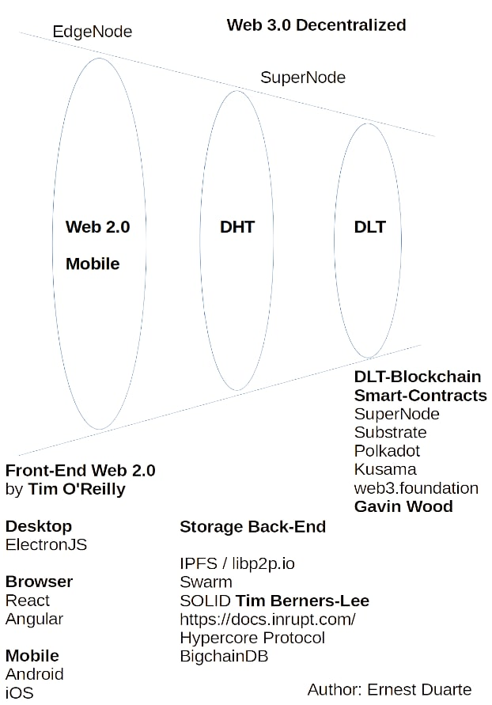

# web3-doc
## Web3 description

- Abstract :  Web3 has three dimentions: money, identity, governance.
- Andreas M. Antonopoulos  : The Internet of Money 
- Dr Gavin Wood : “Less trust, more truth.”

- Web1 is the Internet where everything is free and decentralized, 
- Web2 is the Internet of Uberization Platforms, 
- Web3 is the Internet where everything is paid like in Cloud Computing. The Internet of Money. 

**Web3 = The Internet of Money, Identity and Comunity Governance**

What is Web3 from a technical point of view? Web3 is the juxtaposition of Web2.0 (Described by Tim O'Reilly)  and DLT (example Ethereum) and DHT (example IPFS, Holochain) technologies.

Dr. Gavin Wood proposed a definition of the Web3. A picture is worth a thousand words.

# Main Web3 Skills : 

**Frontend** Web 2.0  —>  Typescript, JavaScript, React.js, VueJS, Angular, Next.js, NodeJS, Ethers.js,  ...

**Backend**  Smart-Contracts —>  Solidity (EVM), Rust, WASM, ...

**Infrastructure** & Cryptography —>  GoLang, Rust, C/C++, ...

Distributed Hash Table (DHT) 
Distributed Ledger Technology (DLT) 

**Network DLT**  —>   Ethereum 2.0, Polygon, Solana, Avalanche, Polkadot/Substrate (EVM Moonbeam), BigchainDB,  Cardano, Tezos, ZK-Rollups (zkSync, StarkNet, Aztec), KSI Blockchain - e-Estonia, ...

**Network DHT** —>  IPFS, Holochain

**IDE** :  Visual Studio Code, HardHat, Truffle Suite

**Wallets** :  Software Wallet MetaMask, Hardware Wallet Ledger

[Introducing the 2022 State of Crypto Report](https://a16zcrypto.com/wp-content/uploads/2022/05/state-of-crypto-2022_a16z-crypto.pdf)

 **What is the problem** : take control of our life and our data.

#  The Basics of Web3 Technologies:
   - P2P distributed systems
   - Distributed Hash Table (DHT) 
   - Distributed Ledger Technology (DLT) 
   - Cryptography
   - Mechanism Design , Game theory
   - Tokenomics
   - DAO Community

#  The main pillars of Web3 projects:
   - Open Source, 
   - Transparency,  ( Transparency does not mean lack of Privacy )
   - Decentralization, 
   - Disintermediation,
   - Community
   - Ownership
   - User Centric
   
#  Blockchain 1.0
- Bitcoin (2009 Satoshi Nakamoto) —> Cryptocurrencies

#  Blockchain 2.0
- Ethereum (2014 Vitalik Buterin) —> Smart-Contracts   

# Blockchain 3.0
- Web3 (Dr Gavin Wood) 
- Internet of Blockchains (example Polkadot and COSMOS/Tendermint)
- Scalability (Transactions Per Second, Net bandwidth, Data Size),
- Interoperability Multi-Chain, Cross-chain compatibility, 
- Sustainability, DAO Community for future development; 
- Deterministic finality
- Layer 2
- ZK-Rollups, ...

#  Tokenomics
   - Categories of Tokens
   - Decentralized Marketplace
   - DAO Community

#  The value proposition
   - Reduce censorship and empower people.

It is about using technology to bring value back to artists, workers and reduce censorship from the few. It is about democratizing art, music with the power of Blockchain technology.

#  TOKENS  Categories 

**Three Sub-Categories**

- Cryptocurrencies like Bitcoin
- Tokens like Utility Tokens
- Central Bank Tokens (CBDCs)

Source : **BRI**  Blockchain Research Institute 

#  Network architecture 

Do Not Forget DLT - Blockchain is a Network which manages a LinkedList called Blockchain too. Ethereum uses LinkedList with  Patricia Merkle Trees ...

- Distributed Hash Table (**DHT**) 
- Distributed Ledger Technology (**DLT**)

# References

[The Meaning of Decentralization - Vitalik Buterin](https://medium.com/@VitalikButerin/the-meaning-of-decentralization-a0c92b76a274)

[web3 foundation  (Dr Gavin Wood)](https://web3.foundation/about/)

[Dr Gavin Wood](http://gavwood.com/)

[Why We Need Web 3.0 (Gavin Wood)](https://gavofyork.medium.com/why-we-need-web-3-0-5da4f2bf95ab)

[Why it’s too early to get excited about Web3 By Tim O’Reilly](https://www.oreilly.com/radar/why-its-too-early-to-get-excited-about-web3/)

- https://2018.web3summit.com/
- https://2019.web3summit.com/

[The Father of Web3 Wants You to Trust Less Gavin Wood, who coined the term Web3 in 2014](https://www.wired.com/story/web3-gavin-wood-interview/)

- https://www.web3.university/

[Web3 Tech Stack Overview](http://wiki.web3.foundation/en/latest/tech_stack/tech_stack_overview/)

[Chaos Computer Club : Web3 Summit 2018 ](https://www.youtube.com/watch?v=CP0Dd4N_bAE)

[Tim O'Reilly attempts to clarify just what is meant by Web 2.0, the term first coined at a conference brainstorming session between O'Reilly Media and MediaLive International, which also spawned the Web 2.0 Conference.](https://www.oreilly.com/pub/a/web2/archive/what-is-web-20.html)

